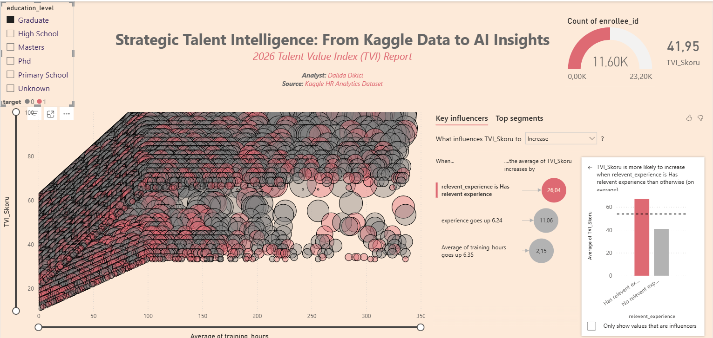

🚀 Strategic Talent Intelligence: An Alchemical Journey 🧪
 "Data is the Map, Storytelling is the Journey" 

In this laboratory, I transformed raw HR data from Kaggle into the 'Elixir' of strategic talent insights. 
Using my proprietary TVI (Talent Value Index) algorithm, I've architected a decision-making dashboard for the 2026 talent landscape.

🔍 The 7 Strategic Pillars (FAQ)
1. The Art of Talent Scoring: What makes a "Champion" candidate?
Designing a high-quality employee experience is a challenge for HR. My answer was the TVI Score. We didn't just look at experience; we calculated it using an weighted algorithm:
  * Experience (35%): Rewarding seniority.
  * Training Hours (45% with Quality Filter): Measuring growth mindset.
  * Relevant Experience (20% Bonus): The "Domain Key" that unlocks the full value of a candidate.
Result: We identified "Opportunities" (High talent, high risk) vs "Champions" (High talent, loyal).

2. The "Dalida" Case: Can a career switcher reach a high TVI score?
Let's analyze a candidate with 12 years of teaching experience, combined with Big Data & AI certifications from ITU and YÖK, and 2.5 months of hands-on experience at FirmaCV.
  * The Math: While the "Relevant Experience" filter might initially scale back the training points, the 12 years of professional discipline and advanced technical certifications create a massive "Experience" score that few entry-level analysts can match.
  * Verdict: Such a profile is a "High Potential Disruptor"—technically sharp and professionally mature.

3. Beyond Scatter Plots: Why add Experience to the background?
Why didn't we just look at TVI and Training Hours? Adding Experience as a dimension allowed us to see the Correlation.
We discovered that for Graduate-level candidates, every 6.24 units of experience leads to a 11.06 point increase in the TVI Score.
Without the experience layer, we would miss the "Stability vs. Agility" trend.

4. What tools powered this analysis?
  * Power BI: Core visualization and dashboarding.
  * DAX: Complex calculations for the TVI Algorithm.
  * Key Influencers (AI): To identify hidden patterns in candidate behavior.
  * Top Segments (Machine Learning): To define the "Golden Profile" of top performers.

5. Why is this analysis valuable for HR Directors?
  * Efficiency: It identifies the top 10 candidates from thousands in seconds.
  * Scientific Hiring: It proves that "Relevant Experience" is the strongest predictor of talent quality, increasing the score by 24.6 points.
  * Retention: It flags "at-risk" talents before they churn.

6. The "Graduate" Deep-Dive: Why focus on the biggest population?
Analysis on the largest segment ensures statistical reliability.
In our study, focusing on Graduates revealed that "Sectoral Alignment" (Relevant Experience) is more critical than just "Training Hours."

7. What does the "Correlation Chart" prove?
It proves that our TVI Algorithm is logically sound.
The positive linear trend between Experience and Talent Score confirms that our weighting system accurately reflects professional growth.

👋 About the Architect Alchemist
I am Dalida Dikici—a Physicist and Mathematician with 12 years of professional discipline. 
Currently alchemying data at Multigroup (Google Projects) and FirmaCV(HR-Tech), while mastering advanced pipelines at ITU and YÖK.

🐾 Living in Kuşadası with my companion Mocha.

[LinkedIn Profile](https://www.linkedin.com/in/dalida-dikici/) | [Let's build a story together!](mailto:dekbenli@gmail.com)

